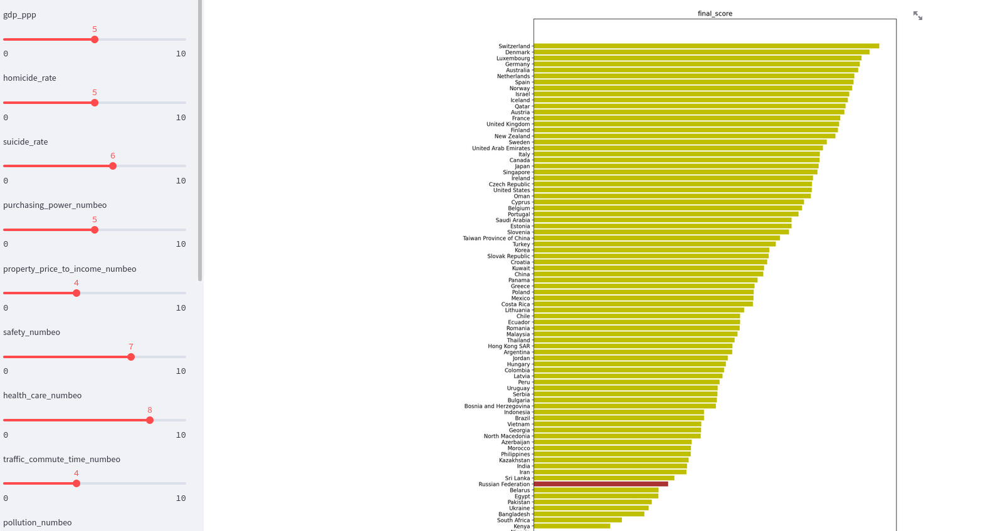

# country-comparison

### The goal.

What the metric we will choose such a place we will take).

I like to compare countries. But I haven't succeeded in finding a fair and
comprehensive rating. 
So I have made my own. Just for fun. 

This repo is an attempt to unite different statistics(features)
in one score. To achieve user-specific results one could regulate the weight of the 
parameter by changing it in the config. 

I chose features for my taste. I didn't use those which look suspicious to me. 
Or just gave them lower coefficients. 

Further explanations about features you can find in **feature_explanation branch**

### App visual interface

### To check the app

[Visit](https://share.streamlit.io/pvgorshenin/country_comparison/main/main.py)

### To run locally

The whole project has been made in python. It uses **streamlit** for the user interface. To run
type the command
`pip install -e .`

and run

`streamlit run main.py`

The web interface will start to be available at `localhost:8501`

The config file is placed in config.yaml. There you can specify default weights for the features.
It could be updated later with the web form. 

You should specify the output folder with `res_filepath` in the config. 

I placed the script's input data in `match_table_filepath` in the config. Right now it 
`data/result/mega_table.csv` 

### Data

Data sources are placed in `source_lst.csv`. As the basic set of countries, I chose the one from the
numbeo. It covers my needs, and it makes matching different sources easier.

I chose not to make automatic scrapping and matching. Sources are pretty diverse in naming, and it is
just faster to make a manual matching. 
Data cleaning and matching could be found in the `making_data` branch.

### Methodology

Each feature is mapped to a `[0, 100]` interval by MinMax scaling. Next, they summed up after multiplying
with **weights** from the user's input. Actually, in the streamlit
interface, I have made `[0, 10]` interval available because of the usability of sliders. 
But under the hood, it is still `[0, 1]`. Obtained results are passed to the MinMax scaling once again to get
the final score.

If the feature contains **outliers** you can specify left and right quantile for clipping an input. 

### Currently available features

`gdp_ppp, homicide_rate, suicide_rate, purchasing_power_numbeo, property_price_to_income_numbeo,
safety_numbeo, health_care_numbeo, traffic_commute_time_numbeo, pollution_numbeo, climate_numbeo, 
life_expectancy, happiness, unesco_objects, distance_to_30_years, gini, incarceration_rate`

### Search a buddie

The algorithm shows the closest country in euclidian space to the input one
(`config[country_to_highlight]`). 
Points in the space are  features received after the run. You can consider it the closest country to 
the input one in your preference's space.
To turn in(off) change `is_buddie_highlight` variable in the config.
